本文探讨的所有问题和解决方案都**基于 Wwise 2017.1.x**。不对后续版本负责。

## 起因：听一下过渡好难

利用 Wwise 的互动音乐功能可以用小段音乐编组搭建出动态和互动的曲式和织体，但搭完了之后你还是得用耳朵试听乐段间的过渡，确保衔接在音乐意义上是无缝的。截至 Wwise 2017.1，不少人在这里遇到了麻烦，见下图：

<!--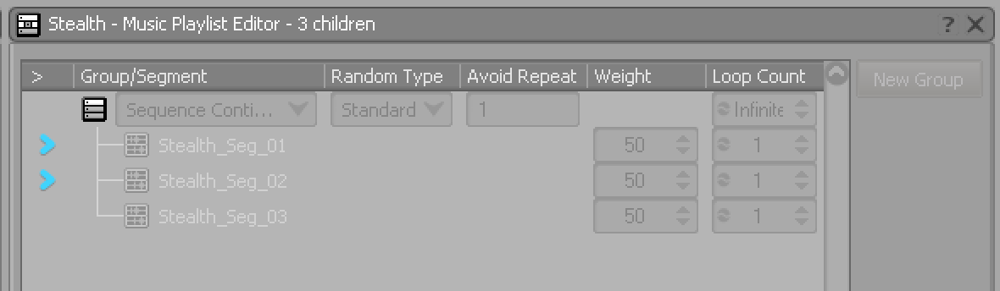-->



这个例子来自 Wwise 自带的示例工程`Sample Project`（可以从Wwise Launcher 的`SAMPLES`页下打开），在 Music Playlist Editor 中，`Stealth`这个 Music Playlist Container 中有一个 Sequence Continuous 模式的 Music Segment 编组，图中正在试听前两个 Music Segment 间的过渡。这时，由于`Stealth`采用的过渡规则中，Source 段用了`Exit source at Exit Cue`这条同步规则，见下图：

<!--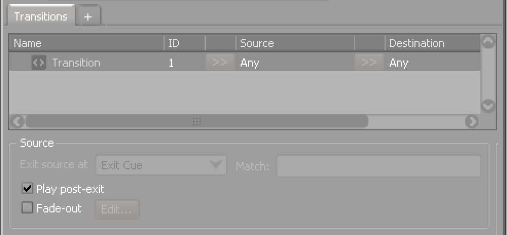-->



Exit Cue 一般靠近曲子尾声，所以你必须把`Stealth_Seg_01`从头听到 Exit Cue 处才能开始试听和`Stealth_Seg_02`间的过渡，如果曲子很长，这样就很浪费时间；还有更惨的：当要听的过渡在一个很长的连续列表的中间靠后时，即便同步点是 Next Bar 这样近距离的，每次你还都得从最顶上听起。如下图：

<!--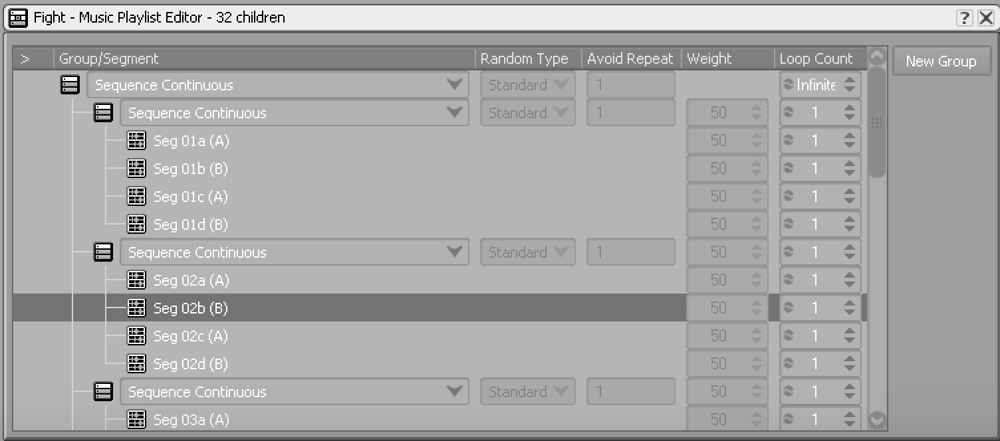-->



要听`Seg 02b (B)`到下一段的过渡时，你每次都得从`Seg 01a (A)`听起。上图里还比较仁慈，每个段落都只循环了一次，万一有些会循环有限次，万一播着中间接了个电话，... 你懂的。

于是你又下意识地跑到 Music Segment Editor 界面中想对着波形迅速定位到过渡点附近听，结果发现一次又只能试听一个 Segment，见下图：

<!--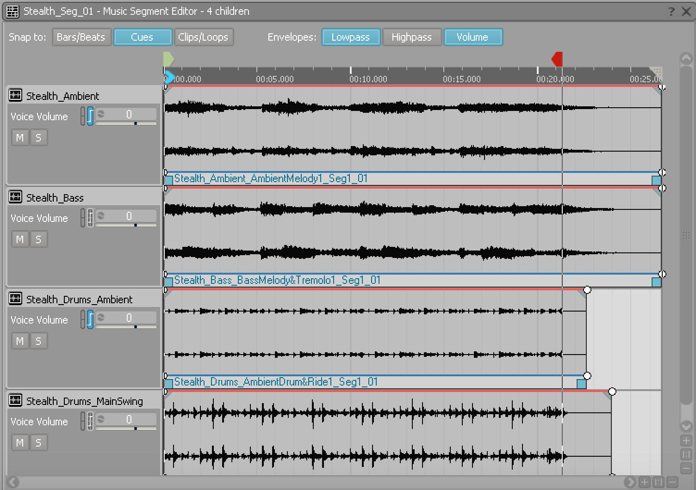-->



所以还是快不起来。

在别的情况下，也会有类似问题：

- 确认单个 Music Segment 的循环无缝时。
- 试听 Music Switch Container 下的状态切换时。

需要强调的是，麻烦大小和设计有关，短小的 Music Segment 可能几乎感觉不到。

面对这些情况，**你的需求大概是这么三条**：

1. 能从播放列表中直接挑出任何一对 Music Segment 来听过渡，不管它们在什么地方。
2. 能定位到过渡点附近开始听。
3. 能试听单曲循环的首尾衔接。

换句话说：如今主流媒体播放器能做到的一些事情。

<!--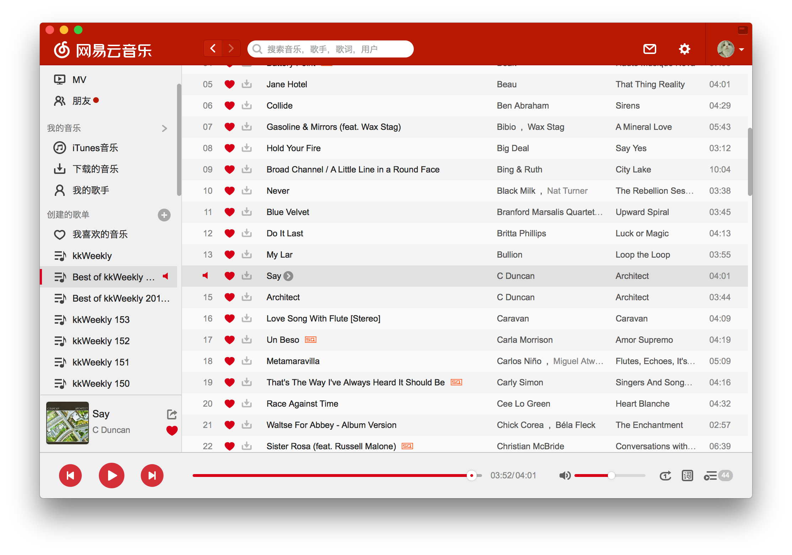-->



上图中，如果你想听`Say`和`Architect`这两首曲子间的过渡（假设有的话），那么只需要鼠标双击`Say`这首，然后用底部进度条定位到尾部收听即可。如果要测自循环，则只需要把循环模式调到单曲循环就行了（注：Wwise 中由于有同步点的问题，常规的进度条还不够）。

相比之下，我们发现：**Wwise 虽然提供了搭建非线性音乐结构的一整套工具，但其 UI 的预览功能不支持线性媒体播放器中的列表定点播放体验。** 当然，反过来大多数线性媒体播放器也不支持 Wwise 提供的众多非线性播放功能。

在 Wwise 在 UI 上做出改进之前，我们暂时还得面对这个问题。

好消息是，“解决方法“（Hack）还是有的，虽然都不完美！
我们来看看到 Wwise 2017.1 版本为止，目前已知的三种方法。我把它们按从直观到抽象排了序。

## 方法一：手动拼接法

看到标题你估计已经有点失望了。没错，这个方法很简单粗暴：通过复制粘贴把想要一起听过渡的几个 Clip 放到 Music Segment Editor 的多轨界面上，手动确保各个 Clip 的 Exit Cue 和 Entry Cue 彼此对齐，最后通过光标直接定位到过渡点附近收听播放。如果要测某一轨的无缝循环，那就把该轨上的内容复制一遍紧贴在自己的尾巴上。

实际操作中有个麻烦：在 Music Segment Editor 下对齐来自两个 Music Segment 的 Clip 时，只有一个 Segment 的 Exit Cue 和 Entry Cue 能显示出来，另一个的则看不到。所以你可能要另想办法来对齐同步点，比如用 Clip handle 临时裁剪掉看不到 cue 的 Music Segment 的 Pre-Entry 或者 Post-Exit 部分，不然很难肉眼对齐。

这个方法的优点是：

1. 概念简单，接近 DAW 里面的操作习惯。
2. 能通过交互来精确定位到过渡点附近。
3. 可以试听任何 Music Segment 甚至单个 Clip 的组合。

但缺点很明显：

1. 用来拼接 Music Segment 的临时操作会改动 Music Segment，污染了设计本身。事后还得清理现场。虽然可以创建专门的“测试段落”，但就要维护这个多轨测试对象，并不轻松。
2. 很难快速测试多轨 Music Segment 间的过渡。上面说的 Clip handle 操作对各轨可能都要做一遍。
3. 手动操作繁琐，对齐容易出错。

这个方法大约只适合粗略测单轨循环的情况。如果非要走这条路，倒还不如直接在 DAW 里面对素材做这些工作来得简单。

## 方法二：快进播放法

这个是 [Wwise 201 认证教程](https://www.audiokinetic.com/courses/wwise201/?source=wwise201&id=configuring_multi_group_playlists_setting_randomized_loop_counts) 中推荐的方法，海内外的一些设计师都有这样用的，见下图：

<!--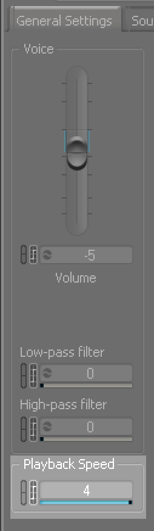-->



将父级容器的播放速度调大，那么播放时过渡涉及的 Music Segment 就能快进到过渡点附近。这时候如果想精听，则可以降回原速，除非你告诉我专业人士的耳朵都是 4 倍速的！

这个方法的优点是：

1. 概念简单。
2. 对设计的污染少。只动一个播放速度参数，用后还是很容易调回来的，因为默认值一般都是 1。

但是缺点仍然很明显：

1. 在 Music Playlist Editor 中，依然无法直接收听任意一对 Music Segment 的过渡，只能从头顺序播放。
2. 这是一种渐进操作，无法一步定位到过渡点附近。
3. 操作上对反射神经有一定要求 ...

## 方法三：Seek 法

这个技巧是海外设计师 Aaron Brown 分享的。基本原理是立足于 Event 及其 Seek（即寻址跳转）这个 Action。跟前两种方法相比，它更能满足本文开始分析的三条需求，但实际操作要绕点路。

Aaron Brown 的原始分享可以在 Wwise 的非官方 Facebook 群`Wwise Wizards & Witches`中找到，但是他只给了粗略的示意图，如下图所示：

<!--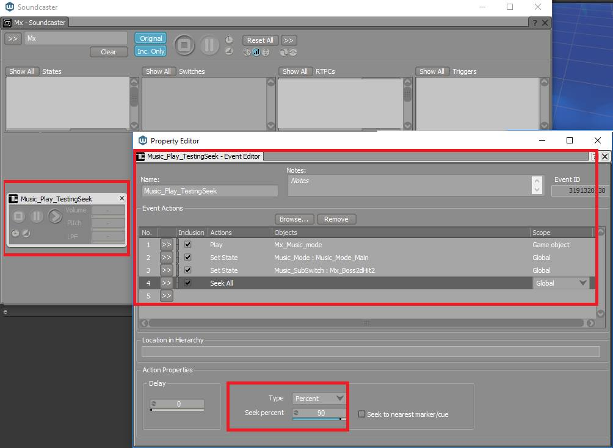-->



但我实操后发现在 Wwise 2017.1 中上面的方法并不能凑效，要修改一些做法。下面详细讲解一下。

### 原理

这个方法是希望避免肉眼定位和等待，实现一键定位到音乐的过渡点附近，按照原速收听过渡。

Wwise 的 Event 中有 Seek 这个 Action 可以定位到播放文件中的指定位置。**前两种方法其实也做了这个定位，只不过是用肉眼和手工操作来确保的：开始试听过渡的播放点必须要在同步点之前。**而针对这点，Seek Action 只需设好跳转位置的数值就可以。并且，它还有服务于互动音乐的[一条诱人的特性](https://www2.audiokinetic.com/library/edge/?source=Help&id=event_actions_list#bp1307910)：

- Seek Action 的 Seek Percent（按百分比跳转）模式下，跳转是相对于 Entry Cue 和 Exit Cue 进行的。

打个比方，不管这些 Cue 设定在 Music Segment 的什么位置，即使我们把跳转设在 99% 处（即 Seek Percent 为 99%），它也绝对不会超出 Exit Cue 而误入 Post-Exit 段；对于单曲循环的情况，跳转百分比位置是相对循环区间来算的。有了这个条件，我们就可以放心定义跳转点来一键空降到过渡点附近了。

不过 Seek Action 还有[一条重要的限制](https://www2.audiokinetic.com/library/edge/?source=Help&id=event_actions_list#seek_seekall_notes_and_restrictions)：

- Music Playlist Container 和 Motion 对象不支持 Seek。

而 Music Segment 不能控制过渡，只能依赖其父级容器，所以在 Event 中实现过渡的唯一希望就是 Music Switch Container 了。你大概明白了吧？**我们要使用 State 切换来模拟所有的过渡情况，在切换状态之前执行 Seek 动作来直接跳转到过渡点之前的邻近位置，就能达到“直接”播放过渡段的目的。**

State 切换要模拟的情况包括:

1. 工程自身互动音乐设计中的状态过渡。
2. Music Playlist Container 里面的相邻 Music Segment 间过渡。
3. Music Segment 单曲循环的首尾衔接。

看起来好像很复杂，但其实只需要把要做过渡的 Music Segment 提取出来，分别关联一个 State，指派给一个测试用的 Music Switch Container 就可以了。

下面我们通过一个实例来说明做法。

### 做法示例

我们还是以 Wwise 安装包自带的`Sample Project`为例来说明 Seek 法的具体操作。简单起见，我们就挑选下图中选中的两个 Music Segment 来举例：

<!--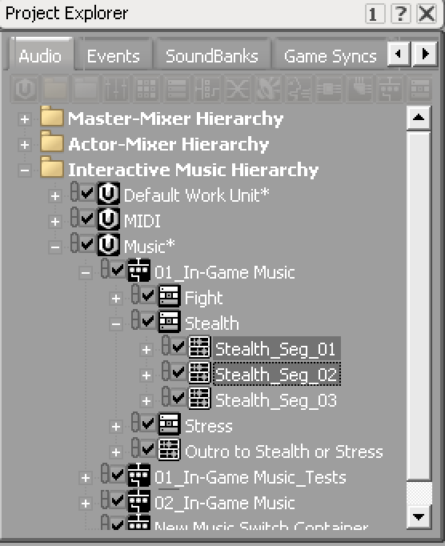
-->



这两个 Segment 也是`Stealth`这个 Music Playlist Container 中顺序播放的相邻对象（见本文第一张图），采用的过渡同步点为 Exit Cue。

**首先，创建一个专用的 Music Switch Container，把`Steath_Seg_01`和`Steath_Seg_02`复制到它下面。**见下图：

<!--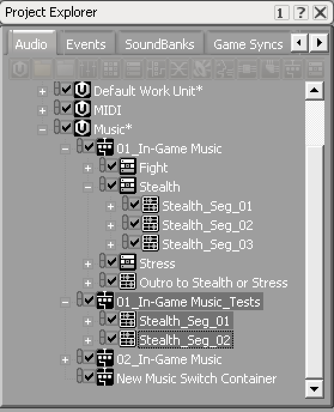-->



创建新的 Music Switch Container 是有原因的：在指定 Music Switch Container 的状态路径的时候，路径对应播放对象只能是该 Music Switch Container 的直接子对象，也就是说之前位于`Stealth`下面的对象如果不挪出来就无法直接关联到 State 上面去；而如果复制到原 Music Switch Container 下面，就又会污染设计。所以比较好的做法是直接创建一个新的 Music Switch Container。

这个专用容器的过渡规则一般只需要用默认的`Any to Any`规则就可以，但要注意默认会播放源段的 Post-Exit 和目标段的 Pre-Entry，不启用淡变。当然，你完全可以按需要来定制整条规则。这里我们重点强调 Exit Cue 的情况。

**接着，创建一个新的 State Group，然后为两个 Music Segment 各创建一个 State。**见下图：
 
<!--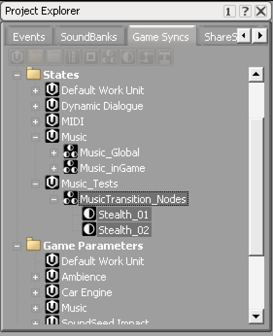-->



**下一步，回到测试专用的 Music Switch Container，设置好状态路径，让上面的 State 和 Music Segment 一一对应。**见下图：

<!--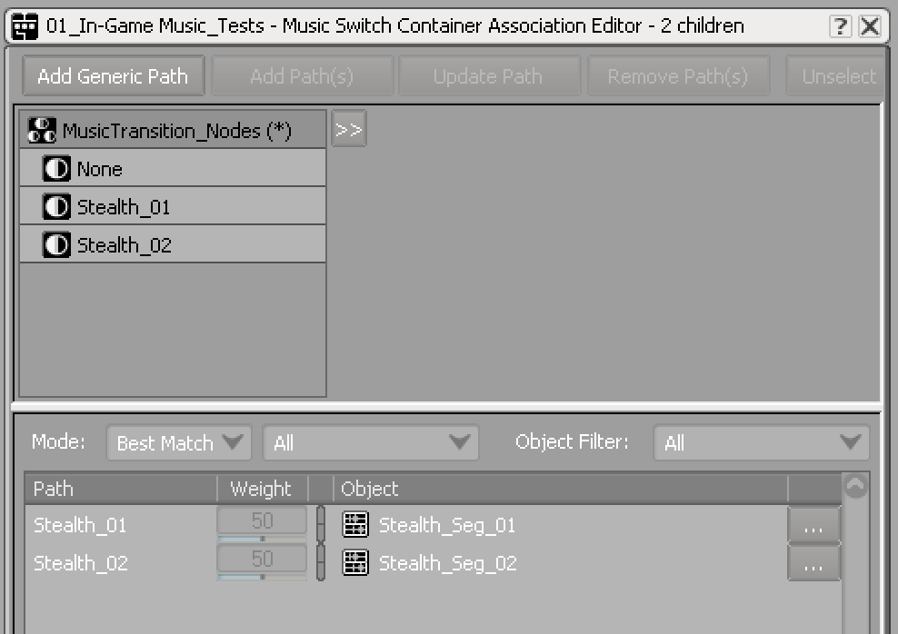-->



**最后，我们创建测试事件**。里面依序包含如下 Action：

<!--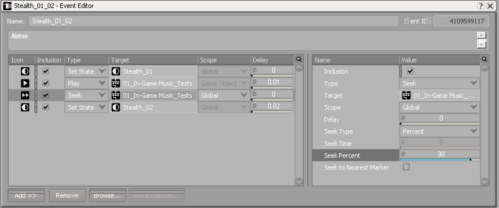-->



- 我们让第一个 Set State Action（状态初始化）比 Play Action 稍早一点执行，确保在播放之前状态已经初始化成源状态，播放源 Segment。这里我们把 Play Action 的 Delay 设为`0.01`， Set State 的 Delay 为 `0`。
- Seek Action 也比播放略提前，Seek 模式为`Seek Percent`，位置为`90%`。你可以视需要修改这个位置。注意：Aaron Brown 在 Wwise 2016.2 中采用 Seek All 这个 Action，Scope 设为 Global，但经测试发现在 Wwise 2017.1 中这个做法无效，要使用 Seek 才行。
- 后一个 Set State Action 也就是状态切换的动作比播放稍晚一点，确保不会覆盖第一个 Set State 操作，导致源 Segment 没能播放起来。所以这里的 Delay 设为`0.02`。

现在测试一下这个 Event，看是不是能一步到位试听过渡？

如果要试听一个 Music Segment 单曲循环的首尾衔接，则可以把问题转化为“从这个段落过渡到它自己的副本”，唯一需要改变的就是要复制源 Music Segment，把它作为目标段落即可。

你可能会问：“我就用同一个 Music Segment，给它关联两个不同的 State 不行吗？”然而 Wwise 中，基于 State/Switch 过渡时前后必须为两个不同的对象，音乐引擎才会启动过渡行为。所以必须给原 Music Segment 做一个副本，才能通过切换 State 来测试自循环过渡。

为了简单，示例中我们就地在工程已有的 Work Unit 中创建试听用的临时对象和其它元素。这样做还是污染了现有设计的，因为 Work Unit 对应 XML 文件，是 Wwise 工程的设计内容实体。所以比较好的做法是创建测试专用的 Work Unit，这样就不会污染，且很容易一键删除所有测试元素。注意，测试对象只要保证不打到 SoundBank 里就不会影响游戏的实际性能。

### 进一步讨论

为了试听一个小小的过渡，Seek 法看起来并不直观，需要好几步操作，这是它最明显的缺点。但是我们可以看到 Seek 法有独特的优势：

1. 它可以满足我们的三条需求。
2. 它不需要人工肉眼对位，也不依赖反应。这点别的工具很难做到。
3. 设好的 Event、Music Switch Container 和 State 可以作为一套可复用的测试框架保留下来，用同一套框架甚至同一个事件测试各种过渡，只用反复改变事件 Action 列表中的 两个 State 就好。
4. 整个流程可以通过 Wwise Authoring API（WAAPI）自动化脚本来加速。

除以上三种方法之外，还可以用 WAAPI 做后端来写一个简单的媒体播放器播放列表界面来达到传统的体验。

## 小结

本文针对很多人提到的“听一下过渡好难”的痛点，总结了一下在不编程或自己写第三方 UI 的情况下，现有能加速试听过渡的方案，希望能给大家一点帮助，权当抛砖引玉，欢迎大家指正和探讨其它可能的技巧和方案。
